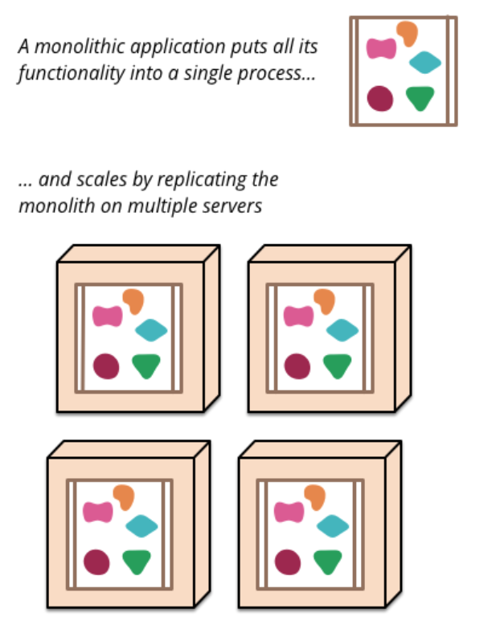
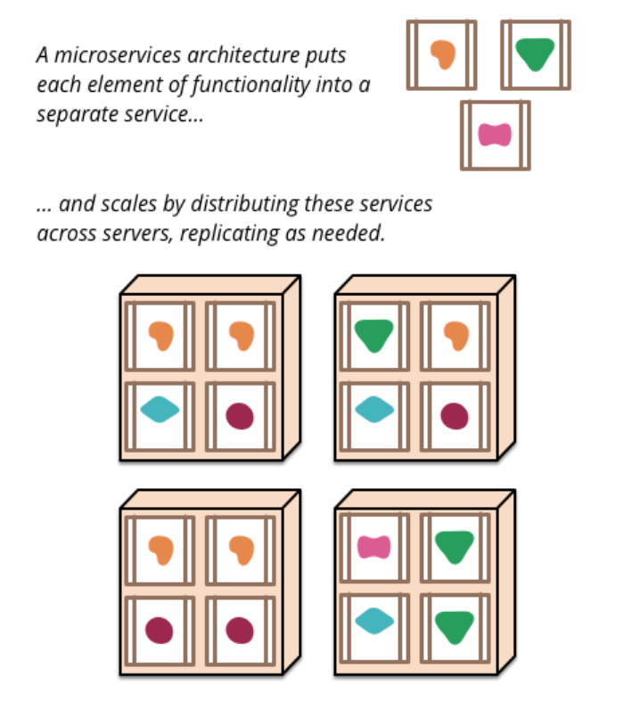

[toc]

### [概述](https://martinfowler.com/articles/microservices.html)

- 简而言之，微服务架构风格是一种将单个应用开发为一个小型服务套件的方法，每个服务运行在它自己的进程中，通过轻量机制进行沟通，比如HTTP，RPC。这些服务围绕业务能力进行构建并通过全自动化的部署机器进行独立部署。极少对这些服务进行集中管理，因为这些服务很可能用不同的语言编写并使用不同的数据存储技术。

- 要开始解释微服务风格，将其与整体风格进行比较很有用：整体应用程序作为单个单元进行构建。 企业应用程序通常由三个主要部分构建：客户端用户界面（由在用户计算机上的浏览器中运行的HTML页面和javascript组成）和数据库（由插入通用（通常是关系型）数据库管理系统中的许多表组成）和服务器端应用程序。 服务器端应用程序将处理HTTP请求，执行逻辑，从数据库中检索和更新数据，以及选择并填充要发送到浏览器的HTML视图。 这个服务器端应用程序就是一个整体，一个单一的逻辑可执行文件。 对系统的任何更改都涉及构建和部署新版本的服务器端应用程序。

- 这样的整体服务是构建此类系统的很自然的方法，处理请求的所有逻辑都在一个流程中运行，所以你可以用编程语言的基本特性将应用分成类、函数、名称空间等等，可以在开发人员的电脑上运行和测试应用程序，并使用部署管道来确保对更改进行了正确的测试并将其部署到生产中，可以通过在负载均衡运行许多实例来水平缩放整体。

- 整体应用可以说是成功的，但越来越多的人对它们感到沮丧，尤其是随着越来越多的应用程序部署到云中。变更捆绑在一起：对应用程序的一小部分进行更改，就需要重建和部署整个整体。随着时间推移，通常很难保持良好的模块化结构，使得仅保留影响该模块中一个模块的更改变得更加困难，扩展要求扩展整个应用程序，而不是部分应用程序，这就需要更多地资源。

  - 整体应用 VS 微服务应用

    

- 以上这些挫败感导致了微服务架构的风格：将应用程序构建为服务套件。除了服务可独立部署和可扩展之外，每个服务还提供了牢固的模块边界，甚至允许用不同的编程语言编写不同的服务，这些服务也可以由不同的团队管理。

- 微服务风格并不是新颖的或创新的，它的根源至少可以追溯到Unix的设计原理。 但是确实没有足够的人会考虑微服务架构，如果使用微服务架构，许多软件开发会更好。

### 微服务架构的特征

#### 通过服务进行组件化

- 自从我们从事软件行业以来，就一直希望通过将组件连接在一起来构建系统，我们看待事物是在物理世界中创造的，在过去的几十年里，我们已经看到了作为大多数语言平台一部分的大型公共库汇编的巨大进步。 
- 当谈到组件时，我们会遇到如何定义组件的难题。我们的定义是，一个组件是一个软件单元，它是可独立替换和升级的。 
- 微服务架构将使用库，但是它们将自己的软件组件化的主要方式是分解为服务，我们将库定义为链接到程序中的组件，并使用内存中的函数调用进行调用， 而服务是与web服务请求等机制通信的进程外组件 ，或远程过程调用。
- 将服务作为组件(而不是库)的一个主要原因是服务是可独立部署的。 如果应用程序在单个进程中包含多个库，那么对任何单个组件的更改导致必须重新部署整个应用程序，但是如果应用程序被分解为多个服务 ，单个服务更改只需重新部署修改的服务。但这也不是绝对的，某些修改会改变服务接口从而导致一些服务之间的协调问题，但是一个好的微服务架构的目标是通过服务契约中的内聚服务边界和演化机制来最小化这些问题
- 使用服务作为组件的另一个结果是一个更显式的组件接口。 大多数语言都没有良好的机制来定义[Publicshed Interface](https://martinfowler.com/bliki/PublishedInterface.html)，通常只有文档和规则才能防止客户破坏组件的封装，从而导致组件之间过于紧密的耦合。通过使用显式远程调用机制，服务可以更容易地避免这种情况。 
- 使用这样的服务确实有缺点。远程调用比进程内调用的开销更大，因此远程api需要是粗粒度的，这通常使用起来更麻烦。如果需要更改组件之间的责任分配，那么当跨越进程边界时，这样的改变就很难实现。
-  在第一个近似中，我们可以观察到服务映射到运行时进程，但这只是第一个近似。一个服务可能包含多个始终一起开发和部署的进程，例如一个应用程序进程和一个仅由该服务使用的数据库。

#### 围绕业务能力进行组织

- 在将大型应用程序拆分为多个部分时，管理层通常侧重于技术层，包括UI团队、服务器端逻辑团队和数据库团队。 当团队按照这些线分开时，即使是简单的更改也会导致跨团队的项目花费时间和预算，聪明的团队会充分利用这一点，选择两害相权取其轻：只要将逻辑强制放到他们能够访问的任何应用程序中就可以了。 换言之，逻辑无处不在。这是一个使用[Conway's Law](http://www.melconway.com/Home/Committees_Paper.html)的例子。

  > Any organization that designs a system (defined broadly) will produce a design whose structure is a copy of the organization's communication structure.
  >
  > -- Melvin Conway, 1968
  

- 微服务的划分方法是不同的，是按照业务能力划分为服务。此类服务采用该业务领域的广泛软件实现，包括用户界面、持久化存储和任何外部协作。 因此，团队是跨职能的，包括开发所需的全部技能:用户体验、数据库和项目管理。  

  

- 跨功能团队负责构建和操作每个产品，每个产品被分割成许多通过消息总线通信的单个服务。 
- 大型整体应用程序也总是可以围绕业务功能进行模块化，尽管这种情况并不常见。当然，我们鼓励团队按照业务线划分构建大型整体应用程序。我们在这里看到的主要问题是，它们往往围绕着太多的上下文进行组织。如果一个整体跨越了许多模块的边界，就很难将它们放入他们的短期内存中。此外，我们看到模块化的代码需要大量的规则来执行。服务组件所需要的更显式的分离使得保持团队边界清晰更加容易。 

#### 产品而不是项目

- 我们看到的大多数应用程序开发工作都使用项目模型 ：目标是交付一些软件，然后被认为是完成的。完成后，软件被移交给维护组织，建立软件的项目团队被解散。 
- 微服务的支持者倾向于避免这种模型，而倾向于团队应该在产品的整个生命周期中拥有它。这方面的一个常见灵感来自Amazon的["you build, you run it"](https://queue.acm.org/detail.cfm?id=1142065)的概念，即开发团队对生产中的软件承担全部责任，这使开发人员每天都要接触到他们的软件在生产中的行为，并增加了与用户的联系，因为他们至少要承担一些支持负担。 
- 产品思维，与业务能力相联系。与其将软件视为一组待完成的功能，还不如将其视为一种持续的关系，即软件如何帮助其用户增强业务能力。 
- 没有理由不能将同样的方法用于整体应用程序，但是服务的更小粒度可以更容易地创建服务开发人员与其用户之间的个人关系。 

#### 智能端点和哑管道 

- 在不同进程之间建立通信架构时，我们看到许多产品和方法都强调在沟通机制本身中加入重要的智慧，这方面的一个很好的例子是企业服务总线(Enterprise Service Bus)，ESB产品通常包括用于消息路由、编排、转换和应用业务规则的成熟工具。 

- 微服务则赞成另一种方法：智能端点和哑管道。微服务构建的应用程序旨在尽可能地解耦和内聚，它们有自己的域逻辑，更多地充当经典Unix意义上的过滤器：接收请求，应用适当地逻辑并生成响应，它们使用简单的`RESTish`协议进行编排，而不是通过中心工具使用复杂的协议，如`WS-Choreography`或`BPEL`或`orchestration`。  

- 最常用的两种协议是带资源API的HTTP请求-响应协议和轻量级消息传递协议(例如`protocol buffers`)。最好的表述是 

  > Be of the web, not behind the web
  >
  > -- [Ian Robinson](https://www.amazon.com/gp/product/0596805829?ie=UTF8&tag=martinfowlerc-20&linkCode=as2&camp=1789&creative=9325&creativeASIN=0596805829)

- 微服务团队使用万维网(在很大程度上是Unix)所建立的原则和协议。 对于开发人员或操作人员来说，只需很少的工作就可以缓存经常使用的资源。
- 常用的第二种方法是通过轻量级消息总线进行消息传递。选择的基础设施通常是哑的(哑充当消息路由器)——简单的实现如RabbitMQ或ZeroMQ，不要提供可靠的异步结构 ——智慧在生产和消费的端点处;也就是服务。 
- 在一个整体风格的应用程序中，组件在进程中执行，它们之间的通信是通过方法调用或函数调用进行的。将一个整体服务变成微服务的最大问题在于改变通信模式。从内存中的方法调用到RPC的简单转换会导致不正常的通信，这不会很好地执行。相反，需要用粗粒度的方法替换细粒度的通信。 

####  去中心化治理

- 中心化治理的后果之一是单一技术平台的标准化趋势。经验表明，这种做法是行不通的，不是每个问题都是钉子，也不是每个解决方法都是锤子。我们更喜欢使用正确的工具来完成工作，虽然整体风格的应用程序可以在一定程度上利用不同的语言，但这并不常见。
- 将整体组件拆分为服务时，我们可以选择性的构建每个服务。你想使用Node.js来建立一个简单的报告页面?就去做吧。用c++做一个接近实时的组件?很好。你想换一个不同风格的数据库，更好地适合一个组件的读取行为?我们有重建它的技术。
- 当然，你可以做一些事情，并不意味着你应该做——但是以这种方式划分系统意味着您可以选择。
- 构建微服务的团队也倾向于使用不同的标准。他们不喜欢使用写在纸上的一套定义好的标准，他们更喜欢开发有用的工具，让其他开发人员可以使用这些工具来解决他们所面临的类似问题。这些工具通常从实现中获得并与更广泛的组共享，有时，但不完全使用内部开放源码模型。现在git和github已经成为事实上的版本控制系统的选择，开源实践在内部变得越来越普遍。
- Netflix就是遵循这一理念的一个很好的例子。将有用的(最重要的是)经过实战测试的代码作为库共享，可以鼓励其他开发人员以类似的方式解决类似的问题，但也为必要时选择不同的方法敞开了大门。共享库倾向于关注数据存储、进程间通信以及基础设施自动化等常见问题。
- 对于微服务社区来说，开销尤其没有吸引力。这并不是说社区不重视服务契约。恰恰相反，因为它们的数量往往更多。只是他们在寻找管理这些合同的不同方法。[Tolerant Reader](https://martinfowler.com/bliki/TolerantReader.html)和[Consumer-Driven Contracts](https://martinfowler.com/articles/consumerDrivenContracts.html)等模式经常应用于微服务。这些援助服务协议在独立演变。作为构建的一部分，执行消费者驱动的契约可以增强信心，并提供关于服务是否在运行的快速反馈。事实上，我们知道澳大利亚的一个团队使用[Consumer-Driven Contracts](https://martinfowler.com/articles/consumerDrivenContracts.html)驱动新服务的构建。他们使用简单的工具来定义服务的契约。甚至在为新服务编写代码之前，这就成为自动构建的一部分。然后，服务被构建到满足合同的程度——这是在构建新软件时避免“YAGNI(You Aren't Going To Need It)”困境的优雅方法。这些技术和围绕它们成长起来的工具，通过减少服务之间的时间耦合，限制了对中央契约管理的需求。
- 或许去中心化治理的巅峰是Amazon推广的build it / run it精神。团队要对他们构建的软件的所有方面负责，包括24/7的运行软件。这种级别的责任下放显然不是一种规范，但我们确实看到越来越多的公司将责任推给开发团队。Netflix是另一家采用这种理念的公司。每天晚上3点被寻呼机吵醒，这无疑是在编写代码时关注质量的强大动力。这些想法离传统的集中式治理模型要多远就有多远。

#### 去中心化数据管理

- 数据管理的去中心化有许多不同的方式，在最抽象的层次上，它意味着世界的概念模型在系统之间是不同的。在跨大型企业进行集成时，这是一个常见的问题，客户的销售视图将与支持视图不同。有些在销售视图中称为客户的东西可能根本不会出现在支持视图中。

- 这个问题在应用程序之间很常见，但也可能在应用程序内部发生，特别是当应用程序被划分为单独的组件时。考虑这个问题的一种有用的方法是[Bounded Context](https://martinfowler.com/bliki/BoundedContext.html)的Domain-Driven Design（简称DDD）概念。DDD将复杂的domain划分为多个bounded context，并映射出它们之间的关系。这个过程对于整体架构和微服务架构都很有用。但是服务和上下文边界之间有一种自然的相关性，这有助于澄清问题，正如我们在业务功能一节中所描述的，要加强这种分离。

- 与概念模型的去中心化决策一样，微服务也有去中心化数据存储的决策。整体应用程序喜欢使用单个逻辑数据库来存储持久化数据，而企业通常更喜欢跨一系列应用程序使用单一数据库，许多这些决定都是由厂商的商业模式驱动的。微服务倾向于让每个服务管理自己的数据库，可以是相同数据库的不同实例，也可以是完全不同的数据库，这叫做[Polyglot Persistence](https://martinfowler.com/bliki/PolyglotPersistence.html)，也可以在一个整体应用程序中使用Polyglot Persistence，但它在微服务中使用得更频繁。

  

- 跨微服务分散数据责任对管理更新有影响，处理更新的常用方法是使用事务来保证更新多个资源时的一致性。这种方法经常在整体应用程序中使用。

- 使用这样的事务有助于保持一致性，但增加了显著的耦合，这在多个服务之间是有问题的，众所周知，分布式事务很难实现，因此，微服务体系结构强调服务之间的无事务协调，一致性可能只是最终的一致性，并且通过补偿操作来处理问题。

- 选择以这种方式管理不一致性对许多开发团队来说是一个新的挑战，但是它通常符合业务实践。通常，业务会选择一定程度的不一致性，以便快速响应需求，同时使用某种逆转过程来处理错误。只要修正错误的成本低于在更大的一致性下失去业务的成本，这种交换是值得的。

#### 基础设施自动化

- 基础设施自动化技术在过去几年中有了巨大的发展——尤其是云和AWS的发展降低了构建、部署和运行微服务的操作复杂性。

- 使用微服务构建的许多产品或系统都是由具有[Continuous Delivery](https://martinfowler.com/bliki/ContinuousDelivery.html)(持续交付)和[Continuous Integration](https://martinfowler.com/articles/continuousIntegration.html)(持续集成)丰富经验的团队构建的。以这种方式构建软件的团队广泛使用了基础设施自动化技术。这在下面所示的构建管道中进行了说明。

  

- 因为这不是一篇关于持续交付的文章，所以我们在这里只关注几个关键特性。我们希望尽可能多地相信我们的软件在工作，所以我们运行许多自动化测试。将工作软件“向上”推进管道意味着我们将自动部署到每个新环境。

- 一个独立的应用程序将被构建、测试和通过这些环境推送。事实证明，一旦您为一个庞然大物投资了自动化生产路径，那么部署更多应用程序似乎就不再那么可怕了。请记住，CD的目标之一就是让部署变得乏味，所以不管它是一个应用程序还是三个应用程序，只要它仍然乏味就没关系。

- 我们看到团队使用广泛的基础设施自动化的另一个领域是在生产环境中管理微服务时。我们在上面断言，只要部署是无聊的，那么在monoliths和microservices之间就没有太大的区别，这与此相反，它们的操作环境可能截然不同

  

#### 容错设计

- 将服务作为组件使用的一个后果是，应用程序需要被设计成能够容忍服务的故障。任何服务调用都可能由于供应方不可用而失败，客户端必须尽可能优雅地响应此请求。与整体风格的应用程序相比，这是一个缺点，因为它增加了处理它的复杂性。其结果是，微服务团队不断地反思服务失败是如何影响用户体验的。Netflix的[Simian Army](https://github.com/Netflix/SimianArmy)在工作日内通过监测服务甚至数据中心的故障来测试应用程序的弹性和监控能力。
- 生产中的这种自动化测试足以让大多数操作组在休假一周之前感到战栗。这并不是说单一的架构风格不能实现复杂的监控设置——只是在我们的经验中不太常见而已。
- 由于服务随时可能发生故障，因此能够快速检测故障并在可能的情况下自动恢复服务非常重要。
- 微服务应用程序非常重视对应用程序的实时监视，检查体系结构元素(数据库每秒接收多少请求)和业务相关指标(例如每分钟接收多少订单)。语义监视可以提供出错的早期预警系统，从而促使开发团队进行跟踪和调查。
- 这对于微服务体系结构尤其重要，因为对编排和事件协作的微服务偏好会导致紧急行为。虽然许多专家都称赞偶然涌现的价值，但事实是，突发行为有时可能是一件坏事。监控对于快速发现不良的紧急行为并加以修复至关重要。
- 整体风格的应用程序可以像微型服务一样透明——事实上，它们应该是透明的。区别在于，您绝对需要知道在不同进程中运行的服务何时断开连接。如果库在同一进程中，这种透明性就不太可能有用。